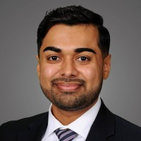
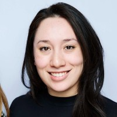
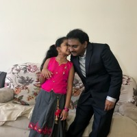
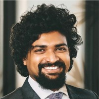
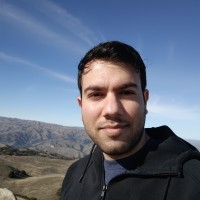

<h1 align="center">Healthcare Hackathon 2026 — Mentor Panel</h1>

<em>Meet the professionals mentoring your cardiac rehabilitation innovation journey.</em>

---

<table>

<tr>
<td align="center">
 
<strong>Mittal Rana, MD</strong> 
Chief Medial Resident, NYU Grossman Long Island School of Medicine 
<a href="https://www.linkedin.com/in/mittalranamd/">LinkedIn</a>
</td>
<td align="center">
 
<strong>Anna Jacobs, MD, MBA</strong> 
Founder, <strong>inclusive+</strong> · General Surgery Resident, NYU Langone Health 
<a href="https://www.linkedin.com/in/annarenjacobs/">LinkedIn</a>
</td>
</tr>

<tr>
<td align="center" width="50%">
 
<strong>Syam Dondapati</strong> 
Assistant Vice President, AIG 
<a href="https://www.linkedin.com/in/syam-the-solution-provider/">LinkedIn</a>
</td>
<td align="center" width="50%">
 
<strong>Varun J. Vincent</strong> 
Founder CEO &amp; CPO, FalconFirstAI 
<a href="https://www.linkedin.com/in/varunjvincent/">LinkedIn</a>
</td>
</tr>

<tr>
<td align="center" colspan="2">
 
<strong>Nihal Kaul</strong> 
Lead Software Engineer, Revscale AI 
<a href="https://www.linkedin.com/in/nihalwashere/">LinkedIn</a>
</td>
</tr>
</table>
